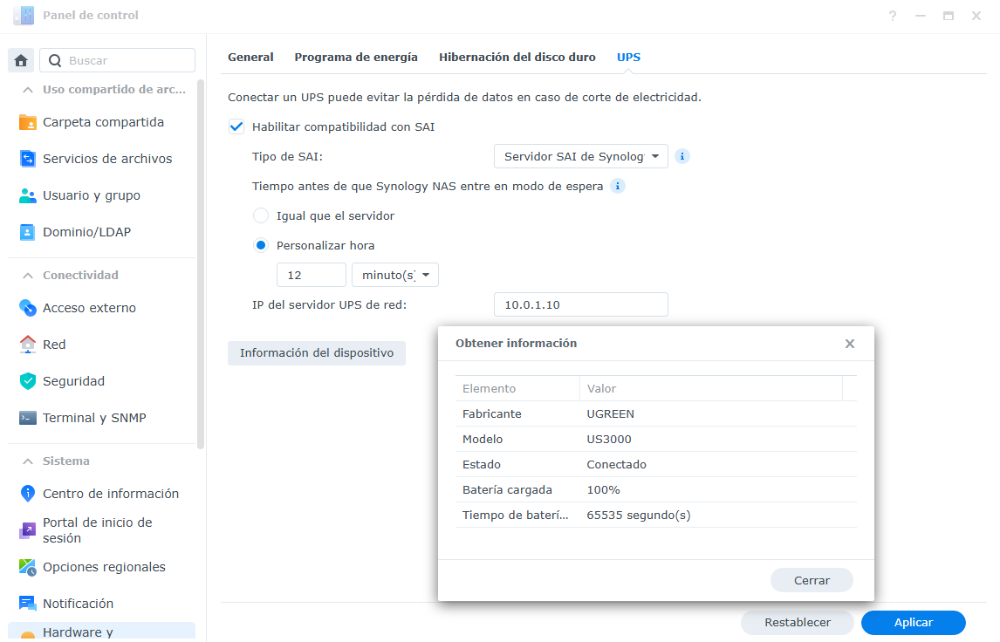

# NUT (Network UPS Tools) for Ugreen US3000 on Synology

A Docker container that enables **Network UPS Tools (NUT)** monitoring and management for the **Ugreen US3000 UPS** on Synology NAS systems.

## 📋 Description

This project provides a containerized NUT server that communicates with the Ugreen US3000 uninterruptible power supply (UPS) via USB. It exposes the UPS status and controls through NUT's network protocol, allowing remote monitoring and automated shutdown management across your network.

### Key Features

- 🐳 **Docker-based** - Easy deployment on Synology NAS
- 🔌 **USB UPS Support** - Direct connection to Ugreen US3000 via USB
- 🌐 **Network Monitoring** - Access UPS status from any device on your network (port 3493)
- 📊 **Real-time Data** - Monitor battery level, remaining time, and more


## 🚀 Usage

### Prerequisites

- Synology NAS with Docker support
- Ugreen US3000 UPS connected via USB
- Container Manager installed

### Installation & Startup

1. **Clone or download this repository** to your Synology NAS:
   ```bash
   git clone https://github.com/yourusername/us3000-synology.git
   cd us3000-synology
   ```

2. **Verify USB Device** (optional):
   - Connect your Ugreen US3000 via USB to your NAS
   - The device should appear with `lsusb`

3. **Create a Container Manager project**:
   - Use the downloaded folder as the source
   
4. **Verify the service is running**

5. **Configure your Synology to use it**:
   - Select UPS type: "Synology UPS Server"
   - Set the shutdown time
   - Enter your NAS IP (localhost is not allowed, you have to type your own IP)

### Environment Variables

- **`TZ=Europe/Madrid`** - Timezone (adjust as needed)

## 📸 Screenshots



## Tested on
  - DSM 7.2 with arc-loader (SA6400 model)

## Notes
Synology does not allow customizing username/secret/ups-name, so they are hardcoded:
  - Username: monuser
  - Secret: secret
  - UPS name: ups

## Known-issues
  - The container does not stop gracefully, it throws an error.
  - Changing settings in the Synology UPS pane causes a restart in the container and an error appears, but changes apply. Just close, and open again the settings page.

## 📝 License

This project is provided as-is for personal use with Synology NAS systems.
